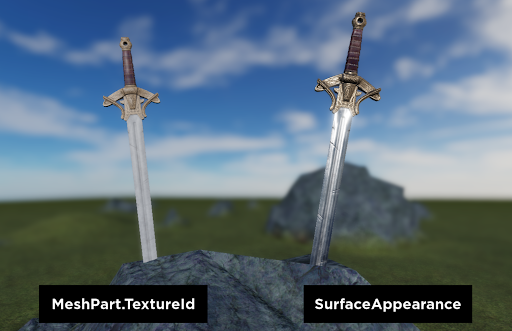
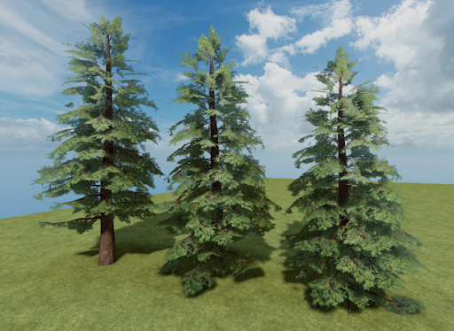
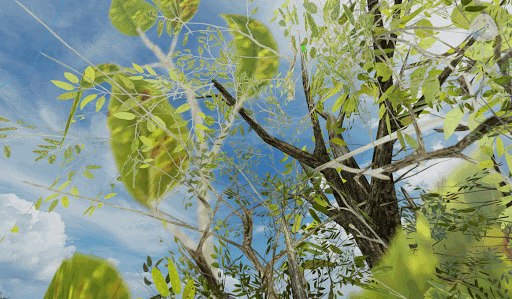
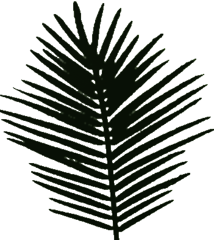
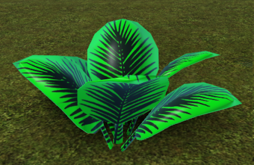
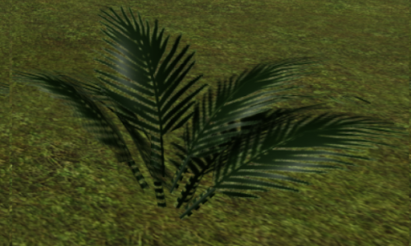
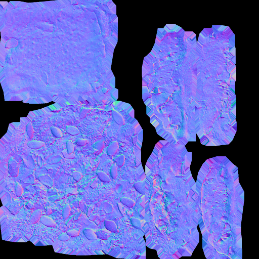
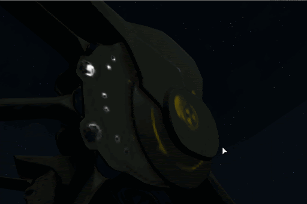
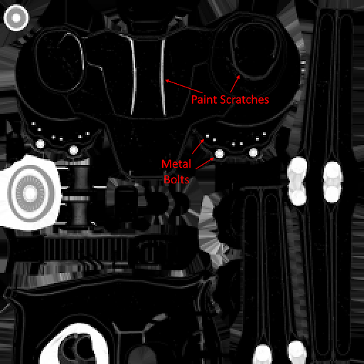

# SurfaceAppearance 

SurfaceAppearance objects allow you to override the appearance of a MeshPart with advanced graphics options. Most notably, a SurfaceAppearance can apply a set of PBR textures to a mesh.

PBR is short for Physically Based Rendering, which refers to a common texture format for defining extra physical details in games. Because this format is widely used, it’s easy to take meshes and textures made in 3rd party editing software and import them into Roblox. It’s also easy to find PBR format content from various 3rd party stores such as [SketchFab](https://sketchfab.com/search?q=pbr+object&sort_by=-relevance&type=models), [TurboSquid](https://www.turbosquid.com/Search/3D-Models/free/pbr), [CGTrader](http://cgtrader.com/pbr-3d-models?polygons=lt_5k).

Here is a mesh with PBR textures [found on Turbosquid](https://www.turbosquid.com/3d-models/3d-model-fantasy-sword---ready/1119210) imported into Roblox.

SurfaceAppearance’s AlphaMode property can also be to improve the look of partially transparent textures on MeshParts by fixing various sorting issues.

How a MeshPart with a SurfaceAppearance looks to users depends on their device and their graphics quality level. You may want to preview your content with different quality level settings.

Note: Most SurfaceAppearance properties cannot be modified by scripts in-game. This is because the Roblox engine needs to do some pre-processing to display a SurfaceAppearance, and this is usually too expensive to perform in-game.

## Properties

### AlphaMode
Determines how the alpha channel of the ColorMap of a SurfaceAppearance is used.

When SurfaceAppearance.AlphaMode is set to Transparency and the MeshPart.Transparency is set to 0, opaque pixels in the SurfaceAppearance’s ColorMap will render as completely opaque in the 3D scene. This solves various problems for textures with different transparent and opaque areas, such as foliage. When parts of the surface are fully opaque, the Roblox engine can render them with proper depth-based occlusion. Opaque surfaces also generally work better with depth-based effects like DepthOfField, glass and water refraction, and water reflection.
MeshPart.TextureId vs SurfaceAppearance:

Here is an example of a fern color map. Only the pixels on the leaves have full alpha.

**Overlay** - Overlays the SurfaceAppearance.ColorMap on top of the underlying part color based on the ColorMap’s alpha channel.

**Transparency** - Renders only the ColorMap using the alpha channel for transparency. Areas of the surface where alpha is 0 will appear completely see-through whereas areas where the alpha is 1 will be completely opaque.

### ColorMap
Determines the color and opacity of the surface. This texture is sometimes called the albedo texture. The alpha channel of this texture controls its opacity, which behaves differently based on the AlphaMode setting.

### NormalMap

Modifies the lighting of the surface by adding bumps, dents, cracks, and curves without adding more polygons.

Normal maps are RGB images that modify the surface’s normal vector used for lighting calculations. The R, G, and B channels of the NormalMap correspond to the X, Y, and Z components of the local surface vector respectively, and byte values of 0 and 255 for each channel correspond linearly to normal vector components of -1 and 1.016 respectively. This range is stretched slightly from -1 to 1 so that a byte value of 127 maps to exactly 0. The normal vector’s Z axis is always defined as the direction of the underlying mesh’s normal. A uniform (127,127,255) image translates to a completely flat normal map where the normal is everywhere perpendicular to the mesh surface. This format is called “tangent space” normal maps. Roblox does not support world space or object space normal maps.

Incorrectly flipped normal components can make bumps appear like indents. If you import a normal map and notice the lighting looks off, you may need to invert the  G channel of the image. The X and Y axes of the tangent space frame correspond to the X and Y directions in the image after it’s transformed by the mesh UVs. If you view your normal map in an image editor as if it were displayed on a surface, normals pointing towards the right side of the screen should appear more red, and normals pointing towards the top side of your screen should appear more green.

The terms “DirectX format” and “OpenGL format” are sometimes used to describe whether the G channel of the normal map is inverted or not. Roblox expects the OpenGL format.

Note: Roblox expects imported meshes to include tangents. Modeling software may also refer to this as “tangent space” information. If you apply a normal map and it does not seem to make any visual difference, you may need to re-export your mesh along with its tangent information from modeling software.

### MetalnessMap
Determines which parts of the surface are metal and are non-metal. A metalness map is a grayscale image where black pixels correspond to non-metals and white pixels correspond to metals.

Metals only reflect light the same color as the metal, and they reflect much more light than non-metals. Most materials in the real world can be categorized either metals or non-metals. For this reason, most pixels in a metalness map will be either pure black or pure white. Values in between are typically used to simulate dirt or grunge on top of an underlying metal area.

Here’s an example of a piece of metal with a layer of paint on top. Most paints are non-metallic, so the metalness map is black everywhere except on unpainted metal parts and spots where the paint has chipped away and the underlying metal is visible.

Note: When Lighting.EnvironmentSpecularScale is 0, metalness has no effect. For the most realistic reflections, setting EnvironmentSpecularScale and EnvironmentDiffuseScale to 1, and Ambient and OutdoorAmbient to (0,0,0) is recommended.

### RoughnessMap
Determines the apparent roughness across the surface. A roughness map is a grayscale image where black pixels correspond to a maximally smooth surface, and white pixels correspond to a maximally rough surface.

Roughness refers to how much variation the surface has on a very small scale. Reflections on smooth surfaces are sharp and concentrated. Reflections on rough surfaces are more blurry and dispersed.
