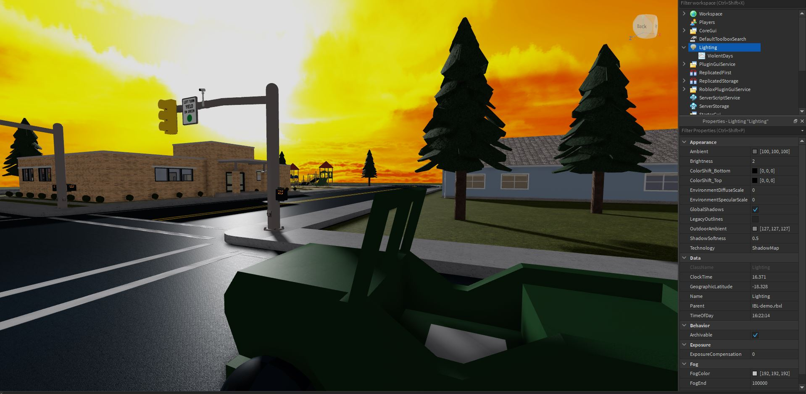
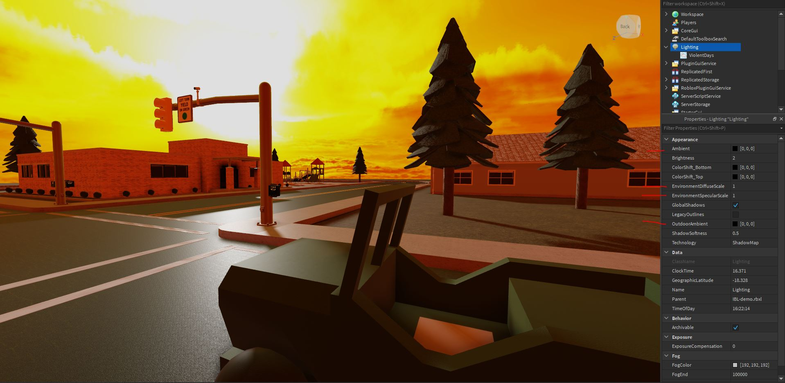
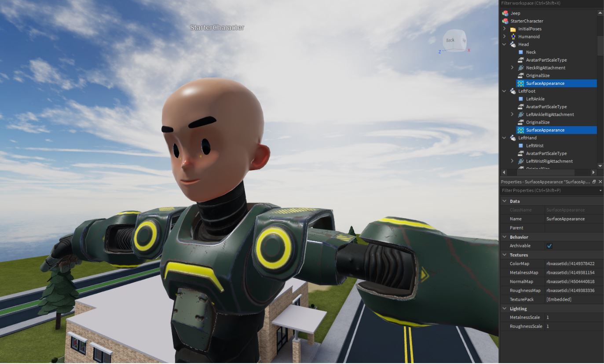
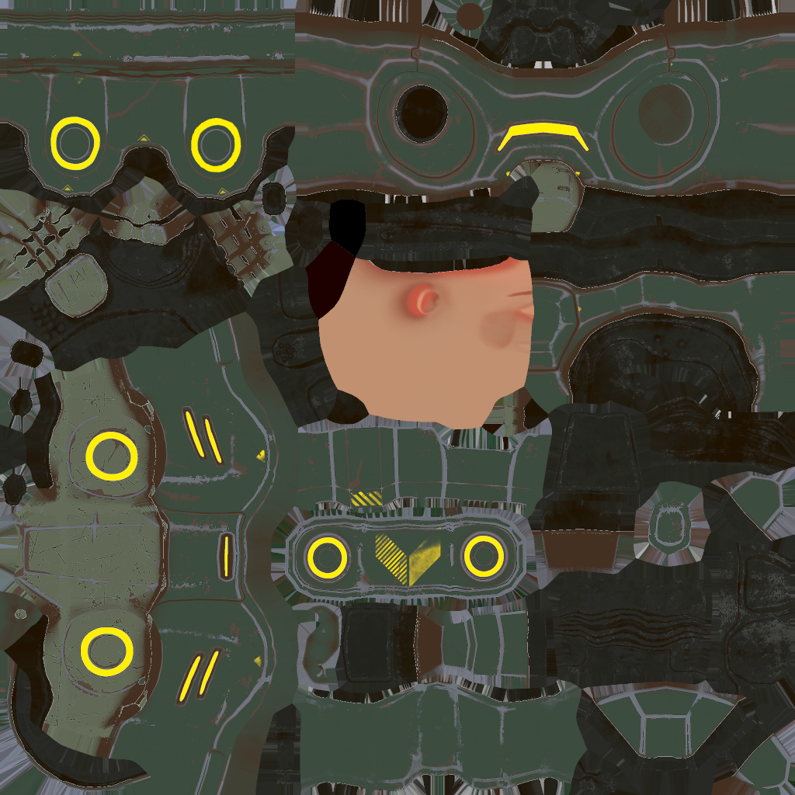
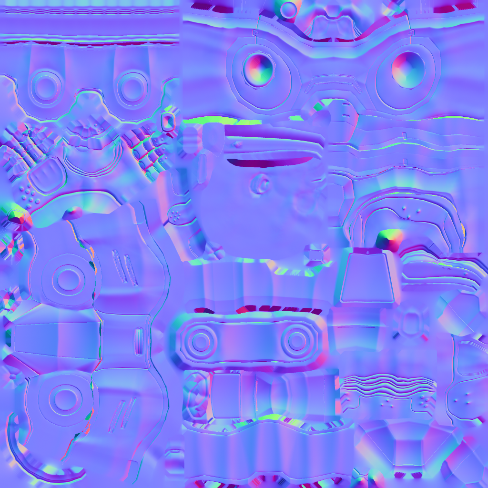
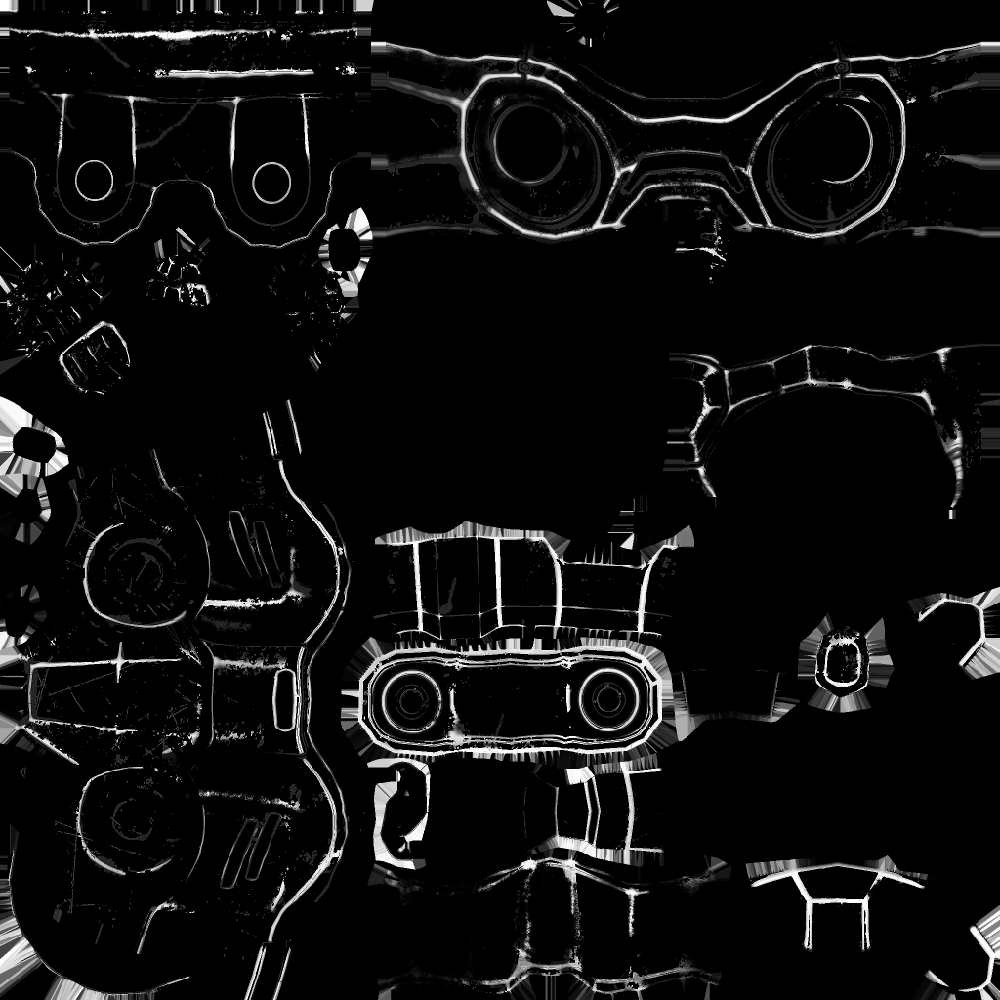

# Physically Based Rendering

We've made significant upgrades to our rendering engine to support more realistic looking materials. The most significant change here is Image Based Lighting - lighting on surfaces that reflects (an approximation) of the surface's surrounding. To get the most out of our rendering upgrades, take these steps:

1. Set Lighting.Ambient and Lighting.OutdoorAmbient to 0,0,0. This will disable constant ambient lighting. Constant ambient lighting can be used to add artificial light for specific art styles or to prevent closed areas from becoming pitch black, but in realistic environments, all "ambient" light that hits an object comes from the object's environment.
2. Set Lighting.EnvironmentDiffuseScale = 1, Lighting.EnvironmentSpecularScale = 1. This will cause objects to reflect light from their environments. We currently use the skybox as an approximation for the environment lighting. **Note:** [there is a bug](https://github.com/Roblox/avatar-evolution/issues/3) where these properties do not show up in the Properties window. They are still accessible through the Command Bar.
3. Insert a better [Sky](api/class/Sky). We've observed that skyboxes with a dark bottom hemisphere tend to produce better looking reflections in our current system. The default skybox doesn't look great, partly for this reason.

Here is an example scene before enabling IBL:

And after:

# SurfaceAppearance

[SurfaceAppearance](api/class/SurfaceAppearance) is an Instance that allows custom normal, metalness, and roughness textures to be fed into the PBR system.

[Mechy.rbxm](files/Mechy.rbxm) is an example character that uses SurfaceAppearances for scratched paint with varying roughness on top of metal armor. You can download the [source FBX file here](files/S15_Mechy.fbx).

Mechy happens to use a single set of textures for the whole body, but it is possible to use different textures for each SurfaceAppearance if desired.

## Color

The color map defines the color of the surface. This performs the same function as [MeshPart.TextureId](api/class/MeshPart).

## Normals

The normal map affects the apparent shape of the surface. You can read more about normal maps [here](https://en.wikipedia.org/wiki/Normal_mapping).
**Note:** When exporting a mesh from 3rd Party software, you must make sure that the equivalent "Export Tangents" setting is enabled. Roblox currently needs tangent data in the mesh file in order to display normal maps.

## Metalness

Many physical properties affect how materials reflect light, but one of the most significant properties is whether the material is a metal or a non-metal. Metals characteristically have high reflectance and low diffuse. Metals also have tinted reflections. When EnvironmentSpecularScale = 0, metal shading is disabled; metal surfaces will appear the same as plastic.

The metalness map is a grayscale map in which black pixels represent non-metals and white pixels represent metals. Gray pixels can be used to represent metals partially covered with dirt, rust, grime, etc.

## Roughness

The roughness map determines how much microsurface variation there is at a given pixel. Black pixels indicate 0% roughness - the microsurface is smooth, resulting in clear reflections and bright, concentrated specular highlights. White pixels indicate 100% roughness - the microsurface is rough, resulting in blurry reflections and larger, less concentrated specular highlights.

### Runtime Scriptability

The above textures cannot be modified in game. This is because we need to perform somewhat expensive processing of all of these textures together in order to display them, and certain devices aren't powerful enough to perform this processing while running a game.
